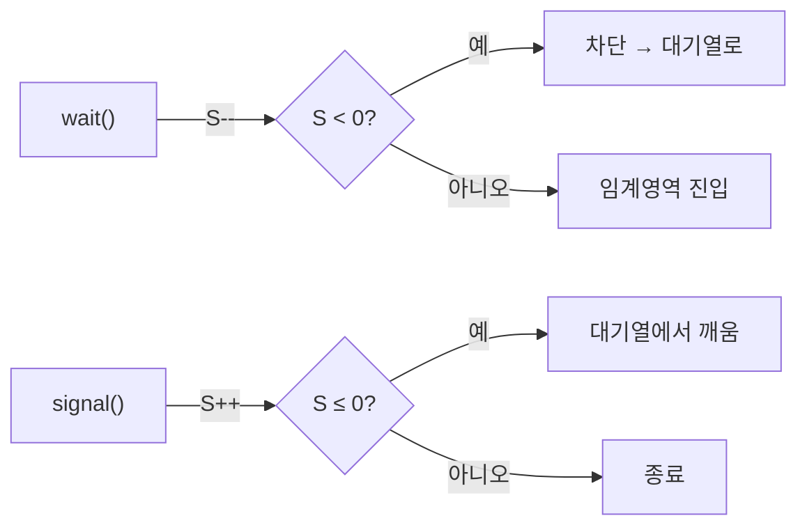
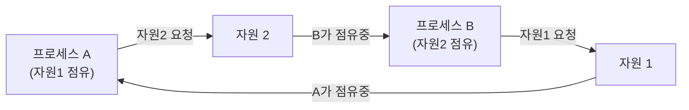

# IPC·동기화·스케줄링·캐시·메모리


## 1. IPC (프로세스 간 통신)

프로세스는 각자 독립된 메모리를 갖기 때문에 서로 데이터를 주고받으려면 별도의 통신 수단이 필요하다.

| 방식 | 핵심 | 다른 기계? |
| --- | --- | --- |
| 익명 파이프 | 혈연관계 단방향 통로 | 불가 |
| 이름 있는 파이프 | 파일 경로로 식별 | 불가 |
| 메시지 큐 | 우편함(비동기) | 불가 |
| 공유 메모리 | 가장 빠름 | 불가 |
| 소켓 | 네트워크 통신 | 가능 |
| 시그널 | 알림용 | 불가 |

왜 공유 메모리가 가장 빠른가? 다른 방식은 데이터가 커널 공간으로 복사됐다가 받는 쪽으로 다시 복사된다(복사 2회). 공유 메모리는 같은 메모리 영역을 직접 보므로 복사 자체가 없다. 대신 동시 접근 충돌을 막을 동기화 책임이 개발자에게 넘어온다. 한편 다른 기계와 통신할 수 있는 건 소켓뿐이다. 네트워크 인터페이스(TCP/UDP)를 쓰기 때문이고, 나머지는 같은 머신 안에서만 동작한다.

파이프의 동작은 커널 안의 임시 버퍼다. 한쪽 구멍으로 넣으면 반대쪽으로 나오고(단방향), 버퍼가 차면 쓰기가 멈추고 비면 읽기가 기다린다. 익명 파이프는 이름이 없어 부모에서 자식으로 물려받는 것만 가능하고(`ls | grep txt`), 이름 있는 파이프는 파일 경로가 있어 관계없는 프로세스끼리도 통신한다.

## 2. 동기화의 출발점: 공유자원, 경쟁상태, 임계영역

이 세 개념은 하나의 이야기로 이어진다. 공유자원을 여럿이 동시에 만지면 경쟁상태가 발생하고, 그 위험한 코드 구간이 임계영역이며, 여기에 한 번에 하나씩만 들여보내(상호배제) 해결한다.

경쟁상태가 왜 생기는지 `count++`로 보자. 이 한 줄은 사실 읽기 → 더하기 → 쓰기 세 단계로 쪼개진다.

```
A: count 읽음 → 0
B: count 읽음 → 0   (A가 저장하기 전에 읽어버림)
A: 1 저장
B: 1 저장           ← 2가 아니라 1! 증가 하나가 사라졌다
```

핵심은 `count++`가 원자적(atomic)이지 않다는 것이다. 중간에 끼어들 수 있어서 문제가 생긴다.

임계영역을 제대로 처리하려면 세 조건을 모두 만족해야 한다. 상호 배제(동시에 한 명만), 진행(비어 있으면 들여보냄), 유한 대기(무한정 기다리지 않음)다.

## 3. 뮤텍스, 세마포어, 모니터

발전 단계로 보면 자연스럽다. 뮤텍스(열쇠 1개) → 세마포어(열쇠 N개 + 신호) → 모니터(잠금 자동화).

| | 뮤텍스 | 세마포어 | 모니터 |
| --- | --- | --- | --- |
| 동시 허용 | 1개 | N개 | 1개(보통) |
| 소유권 | 있음 | 없음 | 있음 |
| 잠금/해제 | 직접 | 직접 | 자동 |

뮤텍스와 세마포어의 결정적 차이는 소유권이다. 뮤텍스는 잠근 주체만 풀 수 있지만, 세마포어는 아무나 신호를 줄 수 있다. 이 때문에 세마포어는 동시 접근 제한뿐 아니라 "한쪽이 끝나면 다른 쪽 깨우기" 같은 신호 전달에도 쓰인다.

세마포어는 `wait`(숫자 −1, 0이면 대기)와 `signal`(숫자 +1, 대기 중인 프로세스 깨움) 두 연산으로 움직이며, 이 둘은 반드시 원자적으로 실행돼야 한다.



모니터가 더 안전한 이유는 잠금을 자동화했기 때문이다. 뮤텍스·세마포어는 `lock()`/`unlock()`을 직접 코드로 써야 해서, 깜빡하거나 에러로 못 풀면 영구 잠금 위험이 있다. 모니터(Java의 `synchronized`)는 들어올 때 자동 잠금, 나갈 때 자동 해제라 실수할 수가 없다.

## 4. 교착 상태 (Deadlock)

두 개 이상의 프로세스가 서로의 자원을 기다리며 둘 다 멈춘 상태다. 좁은 다리에서 마주친 두 사람이 서로 비키라고만 하는 상황을 떠올리면 된다.



발생하려면 네 조건이 모두 충족돼야 한다. 상호 배제(자원 독점), 점유 대기(쥔 채로 다른 자원 기다림), 비선점(강제로 못 뺏음), 환형 대기(A→B→C→A 고리)다.

해결 방법은 네 가지다.

- 예방: 4조건 중 하나를 못 만들게 설계 (예: 자원에 순서를 매겨 환형대기 차단)
- 회피: 은행원 알고리즘으로 안전 상태를 유지하며 할당
- 탐지·복구: 고리를 발견하면 프로세스를 강제 종료해 끊음
- 무시: 현대 OS가 채택. 막는 비용이 더 커서 그냥 두고, 발생하면 "응답 없음"으로 사용자가 종료

현대 OS가 왜 그냥 무시하냐면, 교착은 드물게 일어나는데 4조건을 항상 차단하는 비용이 그보다 크기 때문이다. 은행원 알고리즘은 자원 요청 시 "줬을 때 모두가 끝낼 수 있나(안전 상태)"를 미리 시뮬레이션해 안전할 때만 승인한다. 다만 각 프로세스의 최대 요구량을 미리 알아야 하고 계산 비용이 커서 실무에선 잘 쓰이지 않는다.

## 5. CPU 스케줄링

먼저 선점과 비선점을 구분하자. 선점(preempt)은 빼앗는다는 뜻이다. 비선점형은 한 번 CPU를 잡으면 중간에 못 바꾸고, 선점형은 중간에 끊어서 바꿀 수 있다. 비선점형에는 FCFS, SJF, 우선순위가, 선점형에는 라운드로빈, SRF, 다단계 큐가 있다.

다단계 큐는 우선순위별로 여러 줄을 만들고 높은 줄부터 처리하는데, 한번 배치되면 큐를 못 옮겨서 낮은 큐가 굶을 수 있다. 이를 보완한 다단계 피드백 큐는 큐 사이 이동을 허용한다.

### convoy effect vs starvation

둘 다 "오래 기다린다"지만 결정적으로 다르다. 끝이 있느냐 없느냐다.

convoy effect는 긴 작업에 막혀 뒤의 짧은 작업들이 다 같이 느려지는 현상이다(FCFS에서 발생). 좁은 도로의 느린 트럭 뒤에 승용차들이 묶이는 격이다. 단, 짧은 작업들도 결국엔 실행된다 — 전체 평균 대기시간이 나빠지는 성능 문제다.

starvation(기아)은 특정 프로세스가 무기한 대기하며 영영 실행되지 못하는 현상이다(SJF에서 발생). 계속 새치기당해 굶는 격이다. 특정 프로세스가 영구히 배제되는 공정성 문제이며, aging(시간이 지나면 우선순위를 점점 올림)으로 해결한다.

## 6. 캐시와 지역성

캐시는 자주 쓸 데이터를 미리 담아두는 빠른 저장소로, 빠른 장치와 느린 장치 사이의 속도 차이로 생기는 병목을 줄인다. 찾는 데이터가 캐시에 있으면 히트(빠름), 없으면 미스(메모리까지 다녀옴, 느림)다.

캐시가 효과를 내는 이유는 지역성 덕분이다. 시간 지역성은 최근 쓴 데이터를 곧 또 쓴다는 것(반복문 변수), 공간 지역성은 방금 쓴 데이터 근처도 곧 쓴다는 것(배열 순회)이다. 이 두 성질이 있기에 적은 캐시로도 높은 히트율을 얻는다.

## 7. 캐시 매핑과 주소 구조

캐시는 메모리보다 작아서 "큰 메모리 내용을 작은 캐시 어디에 넣을지" 규칙이 필요하다.

먼저 주소 구조를 알아야 한다. 메모리 주소는 `<P, D>`로 나뉜다. P는 어느 페이지인지, D는 그 페이지 안에서 몇 번째 칸인지를 가리킨다.

여기서 중요한 점은 D는 변환되지 않는다는 것이다. 페이지는 통째로 옮겨지기 때문에 안쪽 칸의 순서가 그대로 유지되기 때문이다. 기차 객실을 다른 기차에 연결해도 객실 안 좌석 번호는 그대로인 것과 같다. 그래서 P만 "지금 어디 있는지" 변환하면 된다.

매핑할 때는 이 P를 다시 `<tag, bd>`로 쪼갠다. bd는 캐시 어느 줄에 넣을지(자리 좁힘), tag는 같은 줄의 여러 후보 중 진짜 맞는지 확인하는 표식(히트/미스 판정)이다.

| | 자리 정하는 법 | 탐색 | 충돌 |
| --- | --- | --- | --- |
| 직접 매핑 | bd로 한 자리 고정 | 빠름 | 많음 |
| 연관 매핑 | 아무 자리나 | 느림 | 적음 |
| 집합-연관 | 집합 좁히고 내부 자유 | 보통 | 보통 |

핵심은 "자리를 얼마나 고정하느냐"의 트레이드오프다. 꽉 묶으면 찾기 쉽지만 충돌이 많고, 풀어주면 충돌은 적지만 찾기 느리다. 집합-연관이 이를 절충해 실무에서 가장 널리 쓰인다(4-way, 8-way).

## 8. 메모리 할당과 단편화

메모리 할당은 크게 연속 할당과 불연속 할당으로 나뉜다.

연속 할당은 한 덩어리로 이어붙여 준다. 고정 분할은 미리 같은 크기로 잘라두는데, 칸보다 작은 프로그램이 들어가면 칸 안에 자투리가 남는 내부 단편화가 생긴다. 가변 분할은 필요한 만큼만 떼어주지만, 쓰고 빼고를 반복하면 빈 공간이 조각조각 흩어지는 외부 단편화가 생긴다. 정리하면 내부 단편화는 "준 공간 안의 자투리", 외부 단편화는 "빈 공간들이 사이사이 흩어져 합쳐 못 쓰는 것"이다.

가변 분할에서 빈 자리가 여럿일 때 어디 넣을지 고르는 방법이 최초 적합(처음 맞는 자리), 최적 적합(가장 딱 맞는 자리), 최악 적합(가장 큰 자리)이다.

불연속 할당은 현대 OS 방식으로, 프로그램을 잘게 쪼개 흩어 넣는다.

| | 자르는 기준 | 외부 단편화 | 강점 |
| --- | --- | --- | --- |
| 페이징 | 같은 크기 | 해결 | 단편화 적음 |
| 세그멘테이션 | 의미 단위 | 생김 | 공유·보안 |
| 페이지드 세그멘테이션 | 의미→같은 크기 | 해결 | 둘 절충 |

페이징이 외부 단편화를 해결하는 이유는 조각 크기를 같게 만들어서다. 다만 페이지드 세그멘테이션은 세그먼트를 페이지로 또 자를 때 크기가 딱 안 떨어지면 마지막 페이지에 자투리(내부 단편화)가 생긴다. 페이징의 약점을 함께 물려받는 셈이다.

## 9. 그 밖의 비교들

busy wait(바쁜 대기)는 조건이 만족될 때까지 "됐나?"를 계속 확인하는 방식이다. 기다리는 내내 CPU를 쓰면서 헛돌기 때문에 안티패턴으로 분류된다. 대안은 블로킹(세마포어가 프로세스를 재웠다가 깨움)이다. 단, 대기가 아주 짧을 것으로 예상되면 재우고 깨우는 비용이 더 커서 busy wait가 유리한데, 이를 스핀락이라 한다.

운영체제와 펌웨어의 가장 큰 차이는 프로그램을 자유롭게 설치할 수 있느냐다. 펌웨어는 ROM 하나에 박혀 정해진 일만 하는 고정형(키보드, 세탁기)이고, 운영체제는 여러 메모리를 계층화해 쓰며 프로그램을 자유롭게 올리는 범용 플랫폼(macOS, Windows)이다.

RAM과 ROM의 핵심 차이는 휘발성 여부다. RAM은 전원이 끊기면 날아가는 작업 공간(책상), ROM은 전원과 무관하게 남는 보관 공간(책장)이다.
