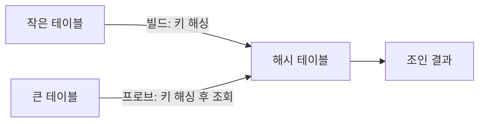
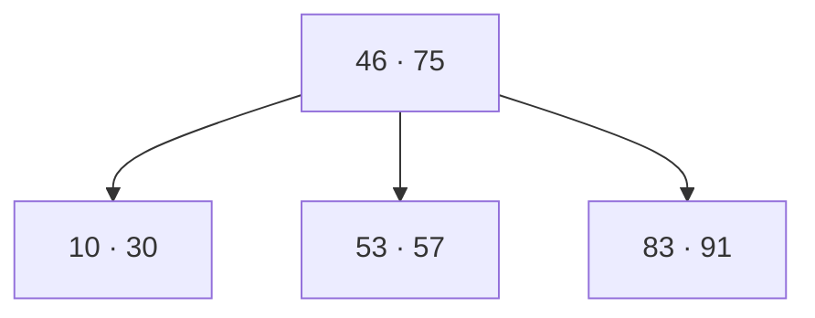

## 1. 조인

조인(Join)은 두 개 이상의 테이블을 연결해 데이터를 탐색하는 방법이다. MySQL은 `JOIN`, MongoDB는 `lookup`으로 처리한다. 내부 조인과 외부 조인으로 나뉜다.

| 조인 | 결과 |
| --- | --- |
| 내부 조인(Inner) | 양쪽에 모두 있는 행만 (교집합) |
| 왼쪽 외부(Left Outer) | 왼쪽 전부 + 오른쪽 일치분, 없으면 NULL |
| 오른쪽 외부(Right Outer) | 오른쪽 전부 + 왼쪽 일치분, 없으면 NULL |
| 전체 외부(Full Outer) | 양쪽 전부, 없는 쪽은 NULL |

외부 조인의 핵심은 한쪽을 통째로 살리고 짝이 없으면 NULL로 채운다는 것이다. 결과에 양쪽이 일치하는 행만 필요해 처리할 데이터가 더 적기 때문에 내부 조인이 더 빠르다. 다만 실제 성능은 쿼리·테이블 구조·인덱스에 따라 갈린다.

MySQL은 `FULL OUTER JOIN`을 지원하지 않아 left와 right를 각각 구한 뒤 `UNION`으로 합쳐 흉내 낸다.

## 2. 조인 알고리즘

먼저, 조인 알고리즘은 개발자가 직접 고르지 않는다. MySQL·PostgreSQL·Oracle 모두 쿼리 옵티마이저가 상황을 보고 가장 빠른 방식을 자동으로 정한다. 그럼 개발자는 아예 손을 못 대나? 힌트로 일부 개입은 된다. 예를 들어 MySQL에서 해시 조인을 막고 싶으면 `SET optimizer_switch="hash_join=off"`로 끈다. 

| 알고리즘               | 방식                            | 시간 복잡도               | 강점 / 조건                    |
| ------------------ | ----------------------------- | -------------------- | -------------------------- |
| 중첩 루프(Nested Loop) | 한 테이블의 각 행마다 상대 테이블 전체를 훑음    | O(M×N)               | 소규모 데이터                    |
| 정렬 병합(Sort Merge)  | 양쪽을 조인 키로 정렬한 뒤 나란히 병합        | O(M log M + N log N) | 이미 정렬됨 / 비등가(`<`,`>`) 조인   |
| 해시(Hash)           | 작은 테이블로 해시 테이블을 만들고 큰 테이블로 조회 | O(M+N)               | **등가(`=`) 조인 전용** / 크기 차 큼 |

중첩 루프는 이중 for문 그대로다. 작을 땐 잘 돌지만 테이블이 커지면 O(M×N)으로 급격히 느려진다. 이를 개선한 블록 중첩 루프는 행이 아니라 블록 단위로 조인 버퍼에 올려 비교해 디스크 접근을 줄인다.

정렬 병합은 양쪽을 미리 정렬해두고 두 포인터로 훑어 내려가며 맞춘다. 왜 `<`, `>` 같은 비등가 조인에 강한가? 정렬돼 있기 때문에 대소비교를 하다가 조건을 벗어나는 값을 만나는 순간, 그 뒤는 전부 조건을 벗어남이 보장돼 더 볼 필요 없이 탐색을 멈출 수 있다. 매번 끝까지 훑는 중첩 루프와 갈리는 지점이다

해시 조인은 두 단계다. 빌드 단계에서 더 작은 테이블의 조인 키를 해시 테이블로 만들고, 프로브 단계에서 다른 테이블의 키를 해싱해 맞는 행을 찾는다.

해시 조회가 평균 O(1)이라 전체가 O(M+N)으로 끝나고, 두 테이블의 크기 차가 클 때 특히 강하다. 그런데 해시 조인이 항상 중첩 루프보다 빠른가? 아니다. 해시 테이블을 메모리에 올려야 하므로, 메모리가 부족하면 그 부담 때문에 오히려 중첩 루프보다 느려질 수 있다. 그리고 등가(`=`) 조인에만 쓸 수 있다는 제약도 있다.

## 3. 트랜잭션

트랜잭션은 하나의 논리적 기능을 수행하기 위한 작업의 단위, 즉 여러 쿼리를 하나로 묶는 단위다. 묶음이 모두 성공했다고 확정해 영구 저장하는 게 커밋, 실패해 묶음 전체를 시작 전으로 되돌리는 게 롤백이다. 트랜잭션 전파는 커넥션 객체를 일일이 넘기지 않고도 여러 메서드 호출을 하나의 트랜잭션으로 묶는 것을 말한다.

### ACID

- **원자성(Atomicity)**: all or nothing. 다 되거나 아예 안 되거나.
- **일관성(Consistency)**: 허용된 방식으로만 데이터를 바꾼다.
- **격리성(Isolation)**: 트랜잭션끼리 서로 끼어들지 못한다.
- **지속성(Durability)**: 성공한 트랜잭션은 영원히 반영된다.

### 트랜잭션 안에서 외부 API를 호출하면 안 되는 이유

면접에서 자주 나오는 질문이다. 트랜잭션 로직 한가운데에서 결제·메일 발송·외부 LLM 호출 같은 외부 API를 부르면 왜 위험한가? **ACID의 원자성(Atomicity)이 깨지기 때문이다.**

원자성은 "전부 되거나 전부 안 되거나"를 보장한다. 그래서 트랜잭션이 중간에 실패하면 롤백으로 모든 걸 없던 일로 되돌린다. 그런데 외부 API 호출은 DB 밖에서 일어나는 일이라 **롤백이 안 된다.** 이미 결제가 나갔거나 메일이 발송됐으면, 트랜잭션을 되돌려도 그 호출까지 취소되지는 않는다. 결국 "DB는 롤백됐는데 외부 호출은 성공" 같은 어긋남이 생기고, 부분만 반영된 이 상태가 곧 원자성 위반이다.

여기서 헷갈리기 쉬운 게 격리성과의 구분이다. "외부 호출도 일종의 공유 자원이라 트랜잭션 간 간섭이 생기니 격리성 아니냐"고 답하기 쉬운데, 격리성은 **여러 트랜잭션이 같은 DB 데이터에 동시 접근할 때 서로 간섭하지 않게 하는** 성질이다. 다루는 범위가 DB 내부의 동시성 통제이지 외부 시스템과의 관계가 아니다. 그래서 이 맥락의 정답은 원자성이다.

그럼 어떻게 해야 하나? 외부 호출을 트랜잭션 밖으로 빼서 **커밋이 끝난 뒤에** 실행하거나, 보낼 작업을 DB에 같이 기록해두고 커밋 후 별도로 전송하는 식(아웃박스 패턴)으로 분리한다. 덤으로, 외부 호출은 응답이 느려서 트랜잭션 안에 두면 그동안 커넥션과 락을 오래 쥐고 있어 동시성까지 떨어뜨린다. 빼야 할 이유가 하나 더 있는 셈이다.

### 격리수준과 이상 현상

격리성은 "무조건 차단"이 아니라 단계가 있다. 왜냐하면 격리성과 동시성이 반비례하기 때문이다. 완전히 순차로 돌리면 격리성은 최고지만 동시성이 죽어 성능이 나빠진다. 그래서 어디까지 허용할지 고른다. 수준이 낮을수록 아래 세 현상이 나타난다.

- **더티 리드(Dirty Read)**: 다른 트랜잭션이 아직 커밋하지 않은(나중에 롤백될 수도 있는) 데이터를 읽는다.
- **반복 불가능 조회(Non-repeatable Read)**: 같은 **행**을 두 번 조회했는데 그 값이 달라진다.
- **팬텀 리드(Phantom Read)**: 같은 범위를 두 번 조회했는데 없던 **행이 추가돼** 유령처럼 나타난다.

뒤의 둘을 한 문장으로 가르면, 반복 불가능 조회는 **행 하나의 값** 변화이고 팬텀 리드는 **테이블의 행 집합**(개수) 변화다.

| 격리수준 | 더티 리드 | 반복 불가능 조회 | 팬텀 리드 | 기본값 DB |
| --- | :---: | :---: | :---: | --- |
| READ UNCOMMITTED | O | O | O | **MongoDB** |
| READ COMMITTED | X | O | O | **PostgreSQL**, Oracle, SQL Server |
| REPEATABLE READ | X | X | O | **MySQL(InnoDB)** |
| SERIALIZABLE | X | X | X | — |

위로 갈수록 빠르지만 위험하고, 아래로 갈수록 안전하지만 느리다. DB별 기본값을 외워두면 좋다. **MySQL의 InnoDB는 REPEATABLE READ**가 기본이라 더티 리드와 반복 불가능 조회는 막지만 **팬텀 리드는 일어날 수 있다.** 새 행이 추가되는 것까지는 막지 않기 때문이다. **PostgreSQL·Oracle·SQL Server는 READ COMMITTED**가 기본이고 실무에서 가장 많이 쓰인다. **MongoDB는 READ UNCOMMITTED**가 기본이다. SERIALIZABLE은 트랜잭션을 사실상 순차로 돌려 모든 현상을 막는, 가장 강하고 가장 느린 수준이다.

## 4. 인덱스

인덱스는 데이터 접근 속도를 높이기 위한 자료구조다. 책의 색인을 떠올리면 된다. 특정 단어를 찾을 때 첫 장부터 넘기는 대신 뒤 색인에서 위치를 바로 찾듯, 인덱스가 있으면 테이블 전체를 훑는 풀스캔 없이 원하는 행을 빠르게 찾는다.

### B-트리와 대수확장성

대부분의 DB(MySQL·PostgreSQL·Oracle)는 인덱스를 B-트리로 구현한다. B-트리는 이진검색트리를 일반화해 노드가 자식을 2개 이상 가질 수 있는 균형 트리다. 모든 리프 노드가 같은 레벨에 있고, 노드가 꽉 차면 분할·비면 병합하며 균형을 유지한다. 탐색은 평균 O(log N)이다.

B-트리가 대용량에서 효율적인 진짜 이유는 O(log N)에 더해 **대수확장성**에 있다. 대수확장성이란 트리 깊이가 리프 노드 수에 비해 매우 느리게 늘어나는 성질이다. 4차 B-트리는 깊이가 하나 늘 때마다 담을 수 있는 항목이 4배씩 불어난다. 자식을 2개가 아니라 여러 개 두어 트리 높이를 낮춘 덕이다. 그래서 깊이 10 정도로 100만 개 레코드를 검색할 수 있다. 데이터가 폭증해도 탐색 단계 수는 거의 안 늘기 때문에 대용량에 유리하다.
