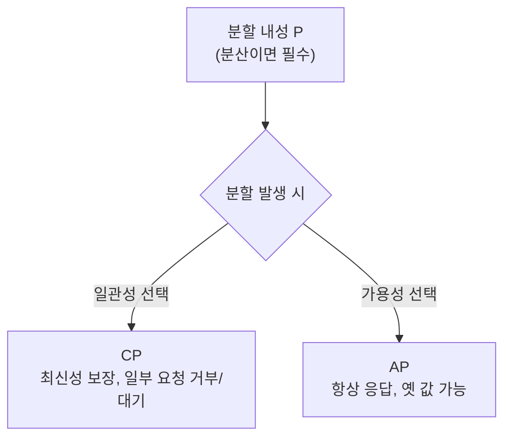

분산 데이터베이스를 고를 때 빠지지 않고 나오는 게 CAP 이론이다. 하나의 분산 시스템은 일관성(Consistency)·가용성(Availability)·분할 내성(Partition tolerance) 세 가지를 동시에 모두 만족할 수 없고, 최대 둘까지만 보장할 수 있다는 이론이다.

## 일관성·가용성·분할 내성

각각의 의미부터 보자.

- **일관성(C)**: 모든 노드가 같은 시점에 같은 데이터를 본다. 읽으면 가장 최근에 쓴 값을 받거나, 아니면 차라리 에러를 받는다.
- **가용성(A)**: 모든 요청이 (에러가 아닌) 응답을 받는다. 단, 그 값이 최신이라는 보장은 없다.
- **분할 내성(P)**: 노드 사이 네트워크가 끊겨 메시지가 유실돼도 시스템이 계속 동작한다.

## 왜 셋 다는 못 가지나

왜 셋 다는 안 되나? 네트워크 분할이 일어난 상황을 그려 보면 답이 나온다. 노드 A와 B의 통신이 끊겼는데 클라이언트가 A에 쓰기를 했다. 이때 B로 읽으러 온 다른 클라이언트에게 (1) 최신값을 못 주니 에러를 내거나 기다리게 하면 일관성은 지키지만 가용성을 잃고, (2) 일단 옛 값이라도 응답하면 가용성은 지키지만 일관성을 잃는다. 분할 상황에서 C와 A를 동시에 만족할 방법은 없다.

## CP냐 AP냐

그런데 분산 시스템에서 네트워크 분할은 "일어날 수도 있는 일"이 아니라 "언젠가 반드시 일어나는 일"이다. 케이블은 끊기고 패킷은 유실된다. 그래서 P는 사실상 선택이 아니라 전제다. 결국 현실적인 선택지는 분할이 생겼을 때 C를 택할지 A를 택할지, 즉 **CP냐 AP냐**로 좁혀진다.

|         | CP                                  | AP                           |
| ------- | ----------------------------------- | ---------------------------- |
| 분할 시 행동 | 일관성 위해 가용성 포기(거부·대기)                | 가용성 위해 오래된 값 허용              |
| 대표 예    | HBase, MongoDB(기본), etcd, Zookeeper | Cassandra, DynamoDB, CouchDB |

그럼 CA는 뭔가? 분할이 없는 시스템, 즉 사실상 단일 노드이거나 전통적인 단일 RDBMS다. 진짜 분산 환경에선 P를 버릴 수 없으니 CA는 분산 DB의 선택지가 되지 못한다.

## NoSQL과의 관계

NoSQL이 CAP와 엮이는 이유는, NoSQL이 애초에 여러 노드로의 수평 확장을 전제로 나온 경우가 많아서다. 그래서 설계자가 CP와 AP 중 무엇을 택했는지가 곧 그 DB의 성격이 된다. 잠깐 옛 값이어도 되는 장바구니·세션 같은 데이터는 AP(카산드라)가 어울리고, 틀리면 안 되는 잔액·재고 같은 데이터는 CP 쪽이 어울린다.
