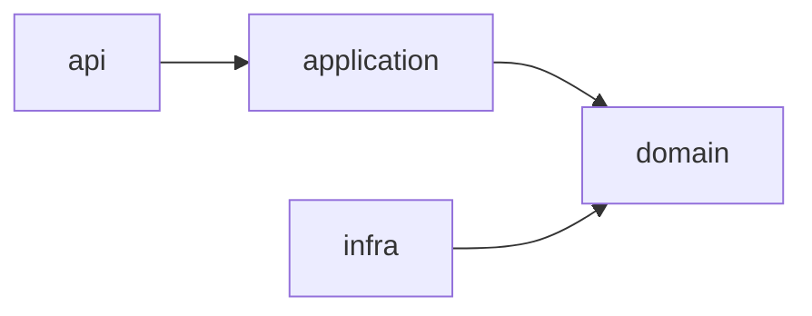

프로젝트가 커지면 하나의 모듈에 모든 코드를 넣는 단일 모듈로는 경계가 흐려진다. 멀티 모듈은 한 프로젝트를 여러 모듈(예: domain, application, api, infra, common)로 쪼개 하나의 빌드로 묶는 구성이다.

## 왜 나누나

첫째, 관심사가 분리된다. 도메인 로직, 외부 연동, 웹 진입점이 각자 모듈로 나뉘면 어디에 무슨 코드가 있어야 하는지가 분명해진다.

둘째, 의존성 방향을 강제할 수 있다. 단일 모듈에서는 도메인 코드가 무심코 인프라(DB·외부 API) 코드를 import해도 컴파일이 된다. 하지만 모듈을 나누고 "domain은 infra에 의존하지 않는다"고 빌드 설정에 박아두면, 그런 잘못된 참조 자체가 컴파일 단계에서 막힌다.

셋째, 바뀐 모듈만 다시 빌드하면 되니 증분 빌드가 빨라지고, 공통 모듈을 여러 곳에서 재사용하기도 좋다.

## Gradle 설정

Gradle이라면 `settings.gradle`에 모듈을 등록하고, 각 모듈의 `build.gradle`에서 의존을 선언한다.

```gradle
// settings.gradle
include 'common', 'domain', 'application', 'api', 'infra'
```

```gradle
// api/build.gradle — api는 application에 의존
dependencies {
    implementation project(':application')
}
```

## 의존성은 도메인을 향한다

흔한 배치는 의존성이 도메인을 향하도록(안쪽으로) 만드는 것이다. 헥사고날·레이어드 아키텍처에서 `api → application → domain` 방향으로 의존하고, `infra`(어댑터)는 domain이 정의한 인터페이스를 구현하며 domain을 바라본다. 이렇게 하면 도메인은 웹이든 DB든 어떤 기술에도 의존하지 않는 순수한 핵심으로 남는다.



## 단점

물론 공짜는 아니다. 모듈 경계와 빌드 설정이 늘어 초기 구성이 복잡하고, 지나치게 잘게 쪼개면 오히려 관리 비용만 커진다. 그래서 "의존성 방향을 지키고 싶은 경계"를 기준으로 적당히 나누는 게 핵심이다.
