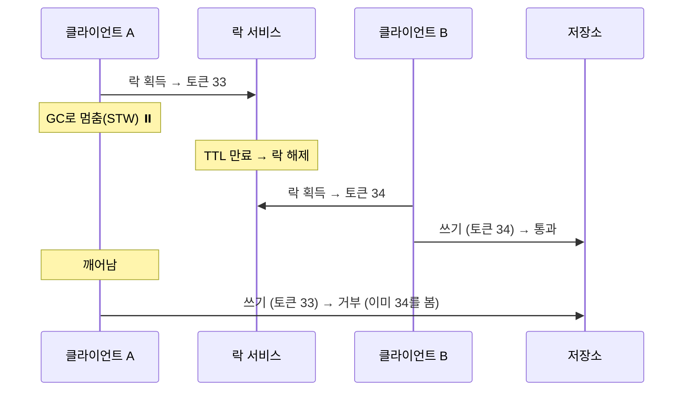

## 낙관적 락

먼저 낙관적 락(optimistic lock)은 이름 그대로 "충돌이 드물 것"이라 낙관하고 실제로 잠그지 않는다. 대신 데이터에 버전(version) 컬럼을 두고, 커밋할 때 "내가 읽었을 때의 버전이 그대로인가"를 확인한다. JPA에서는 엔티티에 `@Version` 필드를 붙이면 된다.

```java
@Entity
class Product {
    @Id Long id;
    int stock;
    @Version Long version; // 낙관적 락 버전
}
```

이때 실제로 나가는 UPDATE는 이렇게 생겼다.

```sql
UPDATE product SET stock = ?, version = version + 1
WHERE id = ? AND version = ?   -- 내가 읽은 그 버전
```

누군가 먼저 수정해서 version이 이미 올라갔다면 `WHERE version = ?`에 걸려 0건이 수정되고, JPA는 이를 감지해 `OptimisticLockException`을 던진다. 충돌을 잠금이 아니라 "버전 불일치"로 잡는 것이다. (반대로 비관적 락은 `SELECT ... FOR UPDATE`로 아예 행을 잠근다.)

## 펜싱 토큰

분산 락에서 나온 개념이다. 분산 락(예: Redis 기반)을 잡은 클라이언트 A가 작업 도중 GC로 멈췄다고 하자. 그 사이 락의 TTL이 만료돼 클라이언트 B가 같은 락을 새로 얻는다. 그런데 A가 깨어나 "난 아직 락 주인인 줄 알고" 저장소에 쓰기를 해버리면, 락이 둘에게 동시에 잡힌 꼴이 되어 데이터가 깨진다.



해결책이 펜싱 토큰이다. 락 서비스가 락을 줄 때마다 단조 증가하는 번호(토큰)를 같이 발급한다. A는 33, B는 34를 받는다. 저장소는 "지금까지 본 토큰보다 작은 토큰의 쓰기는 거부"한다. A가 토큰 33으로 뒤늦게 쓰려 하면 저장소는 이미 34를 봤으므로 33을 막는다. 뒤처진 작업을 잘라내(fence) 버리는 것이다.

## 둘은 같은 아이디어다

여기서 두 개념이 만난다. 낙관적 락의 `version`이 바로 펜싱 토큰과 같은 역할을 한다. 단조 증가하는 번호이고, "옛 버전을 든 뒤처진 작업"을 저장소(DB)가 `WHERE version = ?`로 거부한다. 즉 JPA 낙관적 락은 DB 행 단위로 펜싱을 거는 셈이고, 펜싱 토큰은 분산 락이 보장하지 못하는 상호배제를 저장소 쪽 검증으로 메우는 일반화된 버전이다.

## 분산 락만으론 왜 부족한가

왜 분산 락만으론 부족한가? 락의 TTL과 프로세스 멈춤(GC, [[stop-the-world]]) 때문이다. 락을 쥔 채 멈추면 락은 만료되지만 정작 본인은 그 사실을 모른다. 그래서 "락을 잡았다"는 사실만 믿지 말고, 최종적으로 쓰는 저장소에서 토큰(버전)으로 한 번 더 거르는 게 안전하다.
