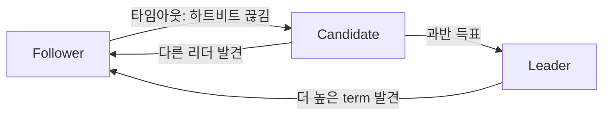

여러 노드가 같은 값(로그)에 합의하도록 만드는 게 분산 합의(consensus)다. Raft는 그 합의 알고리즘 중 하나로, 먼저 나온 Paxos가 너무 어렵다는 문제의식에서 "이해하기 쉬운 합의"를 목표로 만들어졌다. etcd, Consul 같은 시스템이 Raft로 동작한다.

핵심 아이디어는 단순하다. 노드들 중 리더를 한 명 뽑고, 모든 쓰기는 리더를 거치게 한 뒤, 리더가 자기 로그를 팔로워들에게 복제한다. 과반수가 받아 적으면 그 로그는 확정(commit)된다.

## 세 가지 역할

노드는 세 역할 중 하나를 가진다.

- **리더(Leader)**: 클라이언트 요청을 받아 로그를 복제한다. 한 시점에 하나뿐.
- **팔로워(Follower)**: 리더의 명령을 따르고 받아 적기만 한다.
- **후보(Candidate)**: 리더가 없을 때 리더가 되려고 선거에 나선 상태.

## 리더 선출

리더는 왜 필요한가? 모두가 동시에 쓰면 순서와 충돌 문제가 생긴다. 쓰기 창구를 리더 하나로 모으면 순서가 자연스럽게 정해진다.

리더 선출은 이렇게 돌아간다. 리더는 주기적으로 하트비트(빈 메시지)를 보낸다. 팔로워는 일정 시간(election timeout) 동안 하트비트를 못 받으면 "리더가 죽었나?" 하고 스스로 후보가 되어 임기(term)를 올리고 다른 노드들에게 투표를 요청한다. 과반수 표를 받으면 리더가 된다.

여러 팔로워가 동시에 후보가 되면 표가 갈려 아무도 과반을 못 얻는 split vote가 날 수 있다. Raft는 election timeout을 노드마다 랜덤하게 줘서 누군가 먼저 나서게 만들어 이 충돌을 줄인다.

## 왜 과반수인가

왜 하필 과반수(majority)인가? 과반수인 두 집합은 반드시 한 명 이상 겹친다. 그래서 "과반의 동의를 받은 정보"는 다음 과반에도 반드시 살아남아 사라지지 않는다. 이게 Raft 안전성의 핵심이다.

## 로그 복제

로그 복제는, 리더가 클라이언트 명령을 자기 로그에 추가하고 팔로워에 복제한 뒤, 과반이 받아 적으면 그 항목을 commit으로 표시하고 상태 머신에 적용하는 흐름이다. 임기(term)는 논리적 시계 역할을 해서, 오래된 리더가 뒤늦게 깨어나도 더 높은 term을 보고 자신이 한물갔음을 알고 물러난다.

가볍게 정리하면 Raft는 결국 **리더 하나 뽑고(선출) → 리더가 로그를 과반에 복제(복제) → 과반이 받으면 확정** 이 세 박자로 굴러간다.
