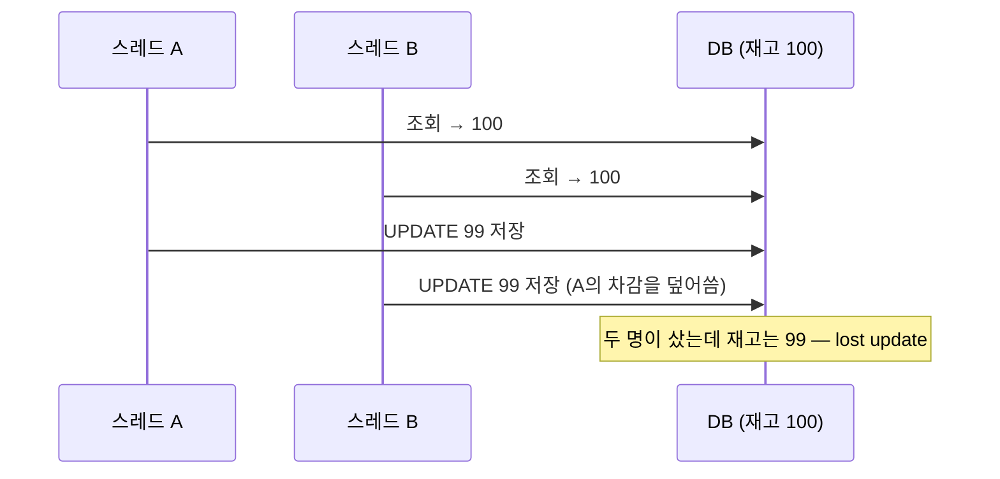

## 락 없는 코드는 어떻게 깨지는가
처음 코드는 조회하고, 깎고, 저장하는 평범한 세 줄이었다.

```java
Stock stock = stockRepository.findByProductId(productId).orElseThrow();
stock.decrease();   // 메모리에서 quantity--
// 커밋 시점에 JPA가 UPDATE
```

혼자 쓰면 멀쩡하고, 동시에 들어오면 깨진다.



**읽기와 쓰기 사이에 남이 끼어들 수 있다.** `ExecutorService`로 스레드 32개·주문 200건을 던지는 테스트로 이 초과판매를 먼저 재현해 놓고 시작했다.


## 세 가지 구현
**1) 비관적 락: 잠그고 읽기**: 잠긴 행 앞에는 대기열이 생긴다.

```java
@Lock(LockModeType.PESSIMISTIC_WRITE)   // SELECT ... FOR UPDATE
@Query("select s from Stock s where s.productId = :productId")
Optional<Stock> findByProductIdForUpdate(@Param("productId") Long productId);
```

**2) 조건부 UPDATE: 검사와 차감을 쿼리 한 방에 처리**: 갱신 행 수 1이면 성공, 0이면 품절.

```java
@Modifying(clearAutomatically = true)
@Query("update Stock s set s.quantity = s.quantity - 1 " +
       "where s.productId = :productId and s.quantity >= 1")
int decreaseStock(@Param("productId") Long productId);
```

명시적 락은 없지만, DB가 같은 행의 UPDATE를 내부 행 락으로 줄 세우기 때문에 원자성이 보장된다.

**3) 낙관적 락: 잠그지 않고, 커밋 때 충돌을 감지해 재시도** `@Version` 컬럼 하나로 감지 장치가 달린다. 재시도 루프는 트랜잭션 밖·별도 빈(facade)에 둬야 한다. 실패한 트랜잭션 안에서 다시 읽어봐야 옛 값이고, 같은 클래스 안 자기 호출은 프록시를 타지 않아 새 트랜잭션이 열리지 않기 때문이다.

```java
while (true) {
    try {
        return orderService.orderOptimisticOnce(buyerId, productId);
    } catch (OptimisticLockingFailureException e) {
        retryCount.incrementAndGet();   // 충돌 → 새 트랜잭션으로 재시도
    }
}
```


## 실측 결과
동시 200건 테스트에서 셋 다 **성공 100 · 재고 0 · oversell 0**을 통과했다. 차이는 k6(VU 200)로 쟀다.

| | 성공 주문 | p95 응답 | 처리량 | 재시도 |
|---|---|---|---|---|
| **조건부 UPDATE** | 100 | **41.6ms** | **1,751 rps** | 0 |
| 비관적 락 | 100 | 79.7ms | 1,232 rps | 0 |
| 낙관적 락 | 100 | 81.4ms | 1,268 rps | **585회** |

조건부 UPDATE가 빠른 이유는 왕복 횟수다. 비관락은 SELECT(잠금)와 UPDATE 사이 내내 락을 쥐고 있지만, 조건부는 UPDATE 한 방이라 락 보유가 짧다.

**낙관락의 재시도 585회는 주문 100건을 위해 헛걸음을 585번 했다는 뜻이다(건당 5.9회).** 재고 행이 하나뿐인 극단적 경합에서는 매 라운드 한 명만 당첨되고 전원이 재도전하기 때문이다. 낙관락은 충돌이 드문 곳(프로필 수정 등)에서 빛나는 도구지, 전원이 같은 행을 노리는 오픈런에 둘 도구가 아니었다.


## 낙관락을 버린 두 번째 이유: 공정성
수치 밖의 문제도 있었다.

| | 재고 행 앞의 "줄" | 결과 |
|---|---|---|
| 비관락 · 조건부 UPDATE | **대기열 있음** (행 락, 도착순 기억) | 굶는 요청 없음 |
| 낙관락 | **줄 없음** — 매 라운드 추첨 | 먼저 온 요청이 계속 질 수 있음(기아) |

한정 수량 **선착순** 판매에서 "먼저 온 손님이 시스템 운으로 밀린다"는 성질은 수치와 무관하게 받아들이기 어려웠다.

최종 선택은 **조건부 UPDATE**다. 차감 규칙이 도메인 메서드가 아니라 쿼리로 들어가고 벌크 UPDATE라 영속성 컨텍스트를 비워야 하는(`clearAutomatically`) 비용을 내고, 최단 락 보유와 최고 처리량을 샀다.


## 같은 철학의 재사용: 예약 만료 복구
이후 예약 주문(`RESERVED` + 만료 시각)을 붙일 때도 같은 질문이 나왔다. 만료 취소(재고 +1)와 신규 차감이 동시에 겹치면 안전한가.

답은 같은 패턴이었다. 상태 전이를 `WHERE status = 'RESERVED'` 조건이 든 UPDATE로 만들면 결제 확정과 만료 취소가 경합해도 **단일 승자**만 남고, 재고 증감은 같은 행 UPDATE끼리 행 락으로 직렬화된다.
