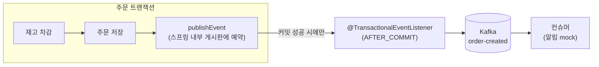
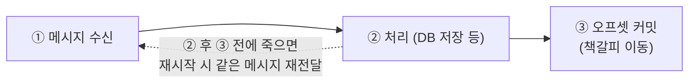
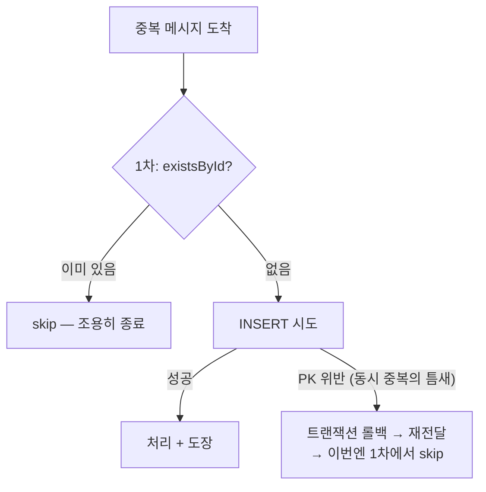

한정 수량 판매 프로젝트에 카프카를 얹었다. 먼저 밝혀두면 **이 규모에 카프카는 과설계다.** 얹은 시점의 후속 처리는 알림 mock 하나뿐이라 메서드 호출로도 충분했다. 그럼에도 얹은 이유는 주문 이벤트의 소비자가 알림·정산·통계로 늘어나는 구조를 가정하고 그 자리를 학습하기 위해서였다. 


## 발행 위치: 유령과 유실 사이
이벤트를 어디서 쏠지부터 정해야 했다.

| | 트랜잭션 안에서 send | **커밋 후 send (선택)** | Outbox 패턴 |
|---|---|---|---|
| 사고 | 롤백됐는데 이벤트만 나감(**유령**) | 커밋 직후 죽으면 이벤트 누락(**유실**) | 없음 |
| 비용 | 없음 | 없음 | 테이블+발행기+재시도 관리 |

유령 이벤트는 DB에 없는 주문을 "완료됐다"고 방송하는 것이라 무조건 거짓말이 된다. 반면 **유실의 피해는 소비자가 무엇을 하느냐에 달렸다.** 지금 소비자는 알림이라, 유실돼도 주문·재고·돈은 온전하고 알림 하나가 빠질 뿐이다. 그래서 커밋 후 발행을 택하고 유실은 감수하되, 발행 실패를 침묵시키지 않도록 에러 로그만 남겼다.

## 구현
커밋은 `@Transactional` 메서드가 리턴한 뒤 프록시가 수행한다. 그래서 발행을 둘로 쪼갰다.



서비스는 스프링 내부 이벤트로 예약만 걸고(네트워크 호출 없음), 실제 send는 커밋 확정 후에 불린다. 롤백이면 호출 자체가 없다.

```java
// 발행자 — 이 트랜잭션이 진짜 커밋된 뒤에만 호출됨
@TransactionalEventListener(phase = TransactionPhase.AFTER_COMMIT)
public void publish(OrderCreatedEvent event) {
    kafkaTemplate.send("order-created", String.valueOf(event.productId()), event)
        .whenComplete((r, ex) -> { if (ex != null) log.error("발행 실패(유실 감수)", ex); });
}
```


## 파티션 키 — 어떤 단위의 순서가 필요한가
카프카는 순서를 **파티션 안에서만** 보장하고, 같은 키는 항상 같은 파티션으로 간다(`hash(key) % 파티션 수`). 그러니 키 선택은 "어떤 단위의 순서가 깨지면 버그인가"라는 질문과 같다.

이 도메인의 사건은 상품을 중심으로 일어나므로(같은 상품의 판매→품절 흐름) **키 = 상품ID**를 골랐다. 대안이던 주문ID는 주문당 이벤트가 한 종류인 현재로선 키 없음과 다를 게 없어 접었다.

Kafka UI로 실물을 확인했다. 파티션 3개 중 키 "1"의 메시지는 몇 번을 보내도 전부 파티션 0에 순서대로 쌓였다. 키 2와 3이 둘 다 파티션 2로 간 것은 배정이 `키 % 3` 같은 단순 나머지가 아니라 해시 결과라 그렇다.

인기 상품 하나에 트래픽이 쏠리면 그 파티션만 바빠지는 **핫 파티션** 리스크는 인지하고 감수했다. 


## at-least-once




## 멱등 소비
처리 기록 테이블 `ProcessedOrder`를 만들었다. 컬럼은 orderId 하나고 그게 PK다. **행의 존재 자체가 "처리했음"이라는 정보**라 다른 컬럼이 필요 없다.

```java
@Transactional
@KafkaListener(topics = "order-created", groupId = "susuggang-order")
public void handle(OrderCreatedEvent event) {
    if (processedOrderRepository.existsById(event.orderId())) {
        log.info("skip (이미 처리): orderId={}", event.orderId());
        return;
    }
    log.info("알림 mock: 주문 완료 orderId={}", event.orderId());
    processedOrderRepository.save(new ProcessedOrder(event.orderId()));
}
```




`existsById`는 "읽고→판단→쓰기"라 동시에 온 중복 둘이 모두 통과할 틈이 있고, 그 틈은 **PK 제약**이 막는다. 재고 차감과 같은 결론이다. 코드의 if는 1차 필터, 최종 보증은 DB 제약이다. 

같은 이벤트를 일부러 두 번 발행하는 테스트로 확인했다. 토픽에는 메시지가 두 개 쌓이지만(카프카는 중복을 제거하지 않는다) 로그는 "알림 mock" 한 번과 "skip" 한 번이다. 


## 결제 확정 추가
프로젝트 후반에 결제 확정(confirm)이 생기면서 두 번째 이벤트와 컨슈머를 붙였다. 확정 트랜잭션 커밋 후 `order-confirmed`를 발행하고, 정산 컨슈머가 받아 정산 장부(Settlement)에 판매자·금액을 기록한다. 알림도 mock 로그에서 실물(알림 테이블 저장 → 화면 알림함)로 바꿨다.

발행은 같은 AFTER_COMMIT 리스너 클래스에 메서드 하나 — KafkaTemplate의 값 타입만 `Object`로 넓히면 JsonSerializer가 타입 정보를 헤더에 실어 보내고 컨슈머는 `@KafkaListener` 파라미터 타입으로 구분한다. 멱등은 정산 장부의 orderId PK가 그대로 담당한다. 도장 테이블 패턴을 한 번 만들어 두니 두 번째 소비자는 복사에 가까웠다.

컨슈머 그룹은 분리했다(`susuggang-order` / `susuggang-settlement`). 그룹이 다르면 어디까지 읽었는지(오프셋)를 각자 관리하므로, 정산이 밀리거나 죽어도 알림 쪽 소비에는 영향이 없다.

![[susuggang-kafka-topics.png]]

![[susuggang-kafka-consumer-groups.png]]
