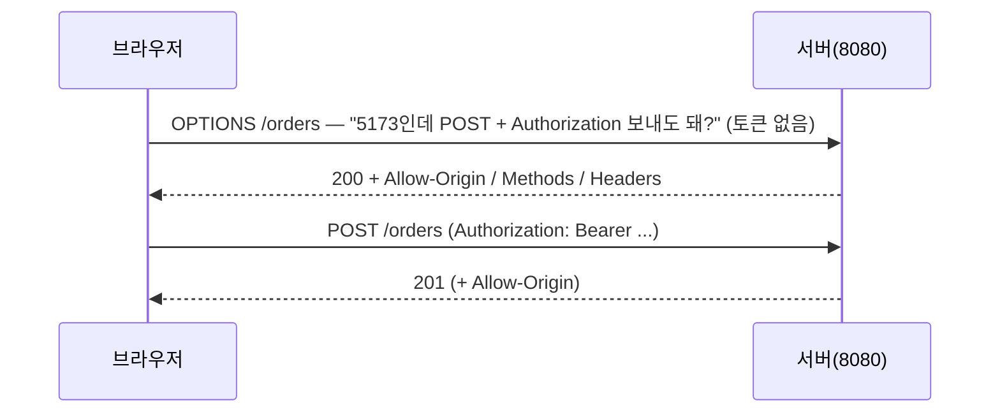
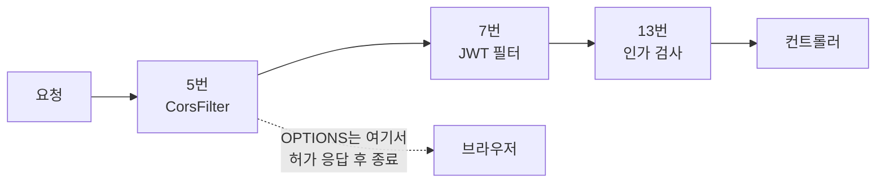

프론트( `localhost:5173`)에서 백엔드(`localhost:8080`)의 상품 목록을 불러오자 오류가 떴다.

> Access to fetch at 'http://localhost:8080/products' from origin 'http://localhost:5173' has been blocked by CORS policy: No 'Access-Control-Allow-Origin' header is present


## 서버는 200을 반환하고 있었다
Network 탭부터 봤다. 차단당한 `GET /products`의 상태 코드는 **200 OK**였고 응답 본문에 상품 JSON까지 도착해 있었다. 다만 응답 헤더 목록에 `Access-Control-Allow-Origin`이 없었다.

크롬의 `net::ERR_FAILED 200 (OK)`라는 표기가 상황을 요약한다. **HTTP는 성공했는데, JS 전달이 차단됐다.**

![[susuggang-cors-blocked-console.png]]

| 흔한 오해             | 실제                                  |
| ----------------- | ----------------------------------- |
| 서버가 요청을 거부했다      | 서버는 일을 다 마쳤다 (200 + 데이터)            |
| 서버 설정 에러다         | **브라우저**가 허가 헤더 없는 응답을 압수한 것        |
| permitAll인데 왜 막히지 | 인증(서버 관문)과 출처 검사(브라우저 관문)는 **다른 층** |

curl로는 같은 API가 멀쩡히 응답한다. CORS는 브라우저 전용 장치라 서버 간 호출에는 존재하지 않기 때문이다.

브라우저가 이러는 근거는 동일 출처 정책(Same-Origin Policy)이다. 악성 사이트가 사용자의 브라우저 권한을 업고 다른 사이트 API를 몰래 호출하는 것을 막기 위해, 다른 출처로의 요청은 기본 차단하고 **서버가 응답 헤더로 명시한 출처만** 통과시킨다. `5173`과 `8080`은 포트가 달라 다른 출처다.


## 해결
허가 규칙을 빈으로 선언하고, 시큐리티 체인에 연결한다.

```java
@Bean
public CorsConfigurationSource corsConfigurationSource() {
    CorsConfiguration config = new CorsConfiguration();
    config.setAllowedOrigins(List.of("http://localhost:5173"));
    config.setAllowedMethods(List.of("GET", "POST", "PUT", "DELETE", "OPTIONS"));
    config.setAllowedHeaders(List.of("Authorization", "Content-Type"));
    config.setMaxAge(3600L);
    UrlBasedCorsConfigurationSource source = new UrlBasedCorsConfigurationSource();
    source.registerCorsConfiguration("/**", config);
    return source;
}
```

```java
http.cors(Customizer.withDefaults())
```


## preflight에는 토큰이 실리지 않는다
주문 API는 `Authorization` 헤더가 붙는 JSON POST라, 브라우저는 본요청 전에 OPTIONS(preflight)를 먼저 보낸다.



중요한 성질 하나. **preflight에는 Authorization 헤더 자체가 실리지 않는다.** 헤더의 이름만 적어 물어볼 뿐이다.

그럼 토큰 없는 OPTIONS가 `anyRequest().authenticated()`인 서버에 도착하면? CORS 설정을 완전히 끄고 재현했다.

![[susuggang-cors-preflight-403.png]]

Network 탭에서 `orders`의 Type이 preflight, Status가 403이고 본요청 `orders`는 CORS error로 끝났다.


## 답은 필터 순서에 있었다
디버그로 필터 체인을 찍어 보면 구조가 보인다.



정상 상태에서 **CorsFilter는 체인 5번** — JWT(7번)·인가(13번)보다 앞이다. preflight는 5번에서 응답받고 종결되므로 인증 검사대에 도착할 일이 없다.

CORS 처리를 시큐리티 뒤(MVC 레벨)에 두거나 연결을 빼먹으면, 토큰 없는 OPTIONS가 13번까지 흘러가 거절당한다. "설정했는데 주문만 CORS 에러"라는 유명한 증상의 정체다. 401이 아니라 403인 것은 별도 인증 진입점을 안 정했을 때의 Spring Security 기본 동작이고, `http.cors()`를 코드 몇 번째 줄에 쓰는지는 무관하다 — 빌더 체이닝은 신청서일 뿐, 필터 자리는 프레임워크의 고정 배치 규칙이 정한다.


## 재현 실험 방해한 것
**1) `.cors()`를 주석 처리해도 동작했다.** Spring Security 6.1부터는 `CorsConfigurationSource` 빈이 있으면 명시 호출 없이도 자동으로 찾아 쓴다. 스위치를 끈 게 아니라 안 누른 것뿐이고, 규칙집(빈)이 남아 있는 한 자동 점등된다. 재현하려면 빈까지 내려야 했다. 그래도 명시 호출은 남겼다. 의도가 코드에 보여야 하고, 버전 기본 동작에 기대고 싶지 않았다.

**2)  `Max-Age`가 관찰을 교란했다.** `setMaxAge(3600)` 때문에 브라우저가 preflight 허가를 1시간 캐시한다. 서버 설정을 바꿔도 OPTIONS가 다시 안 날아와 변화가 즉시 보이지 않았다. CORS 실험은 DevTools의 Disable cache를 켜거나 시크릿 창에서 해야 한다.


## 정리
CORS 에러는 브라우저가 사용자를 보호하려고 응답을 압수하는 **정상 동작**이고, 해결은 서버가 허용 출처를 응답 헤더로 선언하는 것이다. Spring Security에서는 CorsFilter가 인증 필터보다 앞에 배치되어 **토큰 없는 preflight가 인증 전에 응답되는 순서**가 핵심이며, 이 순서가 어긋난 것이 "설정했는데도 안 되는" 사례의 정체다. 진단은 Network 탭에서 OPTIONS의 상태 코드를 보는 것부터 시작하면 된다.
