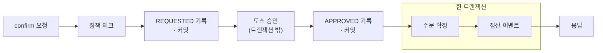

수수깡은 한정 수량 수공예품을 오픈 시점에 선착순으로 파는 커머스다. 주문 제작이 아니라 이미 만들어 둔 작품을 파는 구조라 오픈 순간 같은 재고 행에 주문이 한꺼번에 몰린다. 여기에 토스페이먼츠 결제위젯과 승인 API를 실연동하면서 실패해도 되돌릴 수 없는 돈이 흐르는 구간이 생겼다.

프로젝트의 첫 번째 문제였던 초과판매는 DB에서 끝냈다. 재고 차감을 `UPDATE stock SET q=q-1 WHERE q>=1` 조건부 UPDATE 한 문장으로 처리해서 동시 200 요청에 재고 100이면 정확히 100건만 팔린다. 락 세 전략을 실측 비교해 채택한 과정(p95 107.7ms로 가장 낮았다)은 별도 글로 정리했고 이 글은 그 위에 올린 결제 연동 이야기다.

결제는 처음 다뤄 보는 도메인이었다. 그래서 같은 문제를 실무에서 어떻게 푸는지부터 찾아봤고 골격을 그대로 가져온 것도 있고 우리 상황에 맞춰 다르게 정한 것도 있다. 검증과 보상과 트랜잭션 경계, 세 가지 이야기다.

## 검증: 골격은 가져오고 소비 방식은 바꿨다

결제 승인 전에 확인해야 할 것이 처음에는 금액 하나였다. 클라이언트가 보낸 금액이 서버가 아는 주문 금액과 다르면 승인 호출 자체를 막아야 한다. `PaymentService` 안에 if 한 덩어리로 넣었다.

```java
// 서버가 아는 주문 금액과 대조 — 클라이언트 금액 조작 방지
if (amount == null || amount != price) {
    throw new BusinessException(ErrorCode.PAYMENT_AMOUNT_MISMATCH,
            Map.of("orderId", orderId, "expected", price));
}
```

이 코드에는 아무 문제가 없어 보였다. 검증이 하나뿐일 때는 실제로 문제가 없기도 했다. 문제가 드러난 건 소유자 검증이 필요해졌을 때다. 남의 주문 ID로 결제를 시도하는 경로를 막으려면 검증이 하나 더 붙어야 하는데, 그러려면 서비스 메서드를 열어서 if를 하나 더 써야 했다. 검증이 늘 때마다 결제의 주 흐름을 담은 메서드를 계속 열게 되는 구조였다.

검증 로직을 실무에서는 어떻게 분리하는지 찾아봤다. 스프링 시큐리티부터가 인증 방식들을 `List<AuthenticationProvider>`로 들고 순회하고, 우아한형제들은 [프로모션 유형별 전략을 List 주입으로 조립](https://techblog.woowahan.com/10795/)하며, G마켓은 [플랫폼별 로직을 같은 방식으로 분기 없이 처리](https://dev.gmarket.com/104)한다. 인터페이스 하나에 구현체 여럿을 두고 컨테이너가 목록으로 모아 주입하는 골격이 공통이었다. 이 골격을 가져와 검증을 정책으로 분리했다.

```java
public interface PaymentPolicy {
    void check(PaymentConfirmContext context);   // 위반이면 예외, 계약은 이게 전부
}

// PaymentService, 컨테이너가 @Component 구현체 전부를 모아 채운다
private final List<PaymentPolicy> policyList;

PaymentConfirmContext context = new PaymentConfirmContext(orderId, amount, price, buyerId, order.getBuyerId());
policyList.forEach(p -> p.check(context));
```

스프링은 `List<T>`를 주입받는 자리에 그 타입의 빈을 전부 찾아 넣어 준다. 그래서 코드 어디에도 `new`나 "목록에 추가"가 없다. 서비스가 아는 것은 인터페이스라는 계약뿐이고 어떤 구현체가 몇 개나 들어오는지는 서비스의 관심사가 아니게 됐다. 나중에 소유자 검증 정책을 실제로 추가했을 때 그 커밋의 `PaymentService` 변경은 0줄이었다. 확장에는 열려 있고 기존 코드는 변경에 닫혀 있다는 OCP가 문장이 아니라 diff로 확인된 순간이었다.

정책 클래스는 리포지토리를 뒤지지 않고 넘겨받은 컨텍스트만 보고 판정하게 했다. 덕분에 정책 단위 테스트는 DB 없이 돌아간다. 그리고 이 규약은 리뷰 관례로 두지 않고 ArchUnit 테스트로 강제했다. 서비스가 정책 구현체를 직접 참조하면 빌드가 깨진다. 규칙이 실제로 잡아내는지 보려고 구현체를 직접 참조하는 클래스를 일부러 넣어 실패하는 것까지 확인했다.

다만 한 가지는 참고한 사례들과 다르게 정했다. 우아한형제들의 프로모션이나 G마켓의 플랫폼 분기는 목록에서 조건에 맞는 구현체 하나를 골라 위임하는 선택형이다. 결제 검증은 성격이 다르다. 정책이 하나라도 어긋나면 외부 승인 호출을 막아야 하므로 목록 전체를 실행하되 첫 위반에서 예외로 끊는 방식으로 소비한다. 만약 회원가입 폼 검증이었다면 반대가 맞았을 것이다. 사용자에게 틀린 항목을 한 번에 보여줘야 하니 위반을 전부 수집한 뒤 함께 던져야 한다. 같은 List 주입 구조라도 순회를 소비하는 방식은 도메인이 정한다.

확장점은 꽂는 쪽으로도 다뤄 봤다. 컨트롤러의 인증 사용자 주입은 `@LoginMember` 커스텀 `HandlerMethodArgumentResolver`로 구현했다. 스프링이 열어둔 확장점에 내 구현체를 꽂는 경험과, 같은 형태의 확장점을 내 도메인에 설계하는 경험을 둘 다 해 본 셈이다.

## 보상: 동기 취소를 커밋 후 이벤트로 옮겼다

결제 승인은 성공했는데 주문 확정이 실패하는 경우가 있다. 돈만 나간 상태라 반드시 취소해야 한다. 처음 짠 보상 취소는 `PaymentService` 안의 private 메서드였다.

```java
private void compensate(Payment payment) {
    payment.cancelPending();
    paymentRepository.save(payment);
    try {
        tossPaymentClient.cancel(payment.getPaymentKey(), new TossCancelRequest("주문 확정 실패 자동 취소"));
        payment.cancel();
        paymentRepository.save(payment);
    } catch (FeignException e) {
        log.error("보상 취소 실패 - CANCEL_PENDING 잔류: ...");
    }
}
```

동작은 한다. 다만 두 가지가 걸렸다. 사용자의 응답이 토스 취소 왕복이 끝날 때까지 묶인다. 그리고 그 취소마저 실패하면 남는 게 로그 한 줄뿐이라 복구 경로가 없다. 이미 실패한 요청을 처리하느라 사용자를 더 기다리게 하고 정작 중요한 실패는 흘려보내는 구조였다.

고칠 방향은 부가 로직이 주 행위를 가리는 문제를 스프링 이벤트로 떼어낸 [우아한형제들 회원시스템 글](https://techblog.woowahan.com/7835/)에서 찾았고, 그 구조대로 다시 잡았다. 그 글이 이 패턴을 회원 도메인의 부가 정책을 분리하는 데 썼다면, 수수깡은 돈을 되돌리는 보상 취소까지 같은 패턴 위에 올렸다. 지금은 흔적을 먼저 남기고 실제 취소는 밖으로 뺐다.

```java
} catch (RuntimeException e) {
    compensationService.requestCancel(payment.getId());  // 별도 빈, 새 트랜잭션으로 CANCEL_PENDING 선저장
    throw e;                                             // 커밋 후 이벤트 발행, 취소는 컨슈머가 실행
}
```

`compensationService`를 별도 빈으로 나눈 데는 이유가 있다. 같은 클래스 안에서 일어나는 자기 호출은 프록시를 타지 않아서 `@Transactional`이 조용히 무시된다. 실패한 트랜잭션이 롤백되는 와중에 `CANCEL_PENDING`을 새 트랜잭션으로 확실히 커밋하려면 빈 경계를 넘어야 했다.

주문 확정 쪽도 같은 모양으로 정리했다. 확정 메서드에 알림과 정산과 보상이 섞이면 이 메서드의 주 행위가 무엇인지 읽히지 않는다. 서비스는 "무슨 일이 벌어졌다"는 사실만 발행하고 그것을 누가 어떻게 소비하는지는 모르게 했다.

```java
@Transactional
public void confirmOrder(Long buyerId, Long orderId) {
    if (orderRepository.confirmReserved(orderId, buyerId, LocalDateTime.now()) == 0) {
        throw new BusinessException(ErrorCode.ORDER_NOT_CONFIRMABLE, Map.of("orderId", orderId));
    }
    eventPublisher.publishEvent(new OrderConfirmedEvent(orderId, productId));  // 스프링 이벤트, 아직 카프카 아님
}

@TransactionalEventListener(phase = TransactionPhase.AFTER_COMMIT)
public void publishConfirmed(OrderConfirmedEvent event) {
    send("order-confirmed", String.valueOf(event.productId()), event);
}
```

여기서 `publishEvent`는 카프카 전송이 아니다. JVM 안에서 끝나는 인프로세스 이벤트라서 발행 시점을 트랜잭션 생명주기에 위탁할 수 있다. 결합을 끊는 일은 스프링 이벤트가 하고 프로세스 밖 전달은 카프카가 하는 2단 구조가 된다.

`AFTER_COMMIT`을 고른 이유는 양쪽 사고를 동시에 막기 때문이다. 커밋 전에 메시지가 나가면 롤백됐을 때 DB에 기록이 없는 유령 이벤트가 남는다. 반대로 트랜잭션 안에서 브로커를 호출하면 메시징 장애가 그대로 주문 장애가 된다. 커밋 직후라는 지점이 그 사이의 자리다.

취소 실패는 이제 로그로 끝나지 않는다.

```
(확정 실패) CANCEL_PENDING 저장 → 커밋 후 발행 → 컨슈머가 토스 취소 → CANCELED
(취소 실패) 1초 간격 3회 재시도 → DLQ 격리 → 10분 주기 잔류 스캔이 재투입
(재투입 3회 초과) CANCEL_FAILED 전이 → 자동 복구 중단 · 수동 처리 대상으로 알림
```

재시도가 붙으면 소비는 반드시 멱등이어야 한다. 카프카는 최소 한 번 전달을 보장하므로 같은 메시지가 두 번 오는 것이 비정상이 아니라 정상이다. 알림은 유니크 테이블로, 정산은 orderId 자연키 PK로, 취소는 상태 검사로 중복을 거른다. 별도의 처리 이력 테이블은 만들지 않았다. DB 상태 자체가 멱등의 기준이 되게 했기 때문이다. 그래서 이벤트에는 ID만 싣는다. 컨슈머가 소비하는 시점에 조회하면 언제나 최신 상태로 판정한다.

남은 구멍은 커밋과 발행 사이다. 그 틈에서 프로세스가 죽으면 이벤트는 유실된다. 돈이 걸린 두 경로만 골라서 DB 상태를 재발행 큐로 썼다. 10분 주기 스캔이 보상 쪽에서는 `CANCEL_PENDING`으로 남아 있는 결제를, 정산 쪽에서는 정산 장부가 없는 확정 주문을 다시 투입한다. 소비가 멱등이라 중복 투입돼도 안전하다. 알림은 유실을 감수하기로 했다. 모든 이벤트에 보장이 필요해지는 시점의 답은 아웃박스라는 것까지 정리해 두고 이번 범위에서는 적용하지 않았다.

## 트랜잭션 경계: 장애 사례를 보고 그었다

경계를 긋기 전에 결제 도메인의 장애 사례부터 찾아봤다. [HikariCP 커넥션 고갈 원인 정리](https://blog.path-finder.jp/troubleshooting/hikaricp%EC%9D%98-connection-is-not-available-request-timed-out-%EA%B7%BC%EB%B3%B8-%ED%95%B4%EA%B2%B0%ED%95%98%EA%B8%B0/)는 커넥션이 마르는 원인 중 하나로 트랜잭션 안의 외부 API 호출을 지목하고, 경계를 바로 긋는 것을 첫 해결책으로 든다. [카카오페이의 MSA 네트워크 예외 글](https://tech.kakaopay.com/post/msa-transaction/)은 타임아웃을 성공도 실패도 아닌 결과 미상 상태로 다룬다. 외부 결제에는 세 가지 성질이 있다. 실패 경로가 여럿이고 돈은 롤백되지 않으며 결과를 알 수 없는 상태가 존재한다. 여기에 이 두 글의 관점을 겹쳐 규칙 셋을 정했다.



첫째, 외부 왕복은 트랜잭션 밖에 둔다. 승인 호출의 타임아웃이 30초인데 그 호출이 DB 커넥션을 물고 기다리면 동시 요청이 몰릴 때 커넥션 풀이 마른다. 외부에서 이미 벌어진 일은 롤백 대상도 아니다. 커넥션 고갈 사례의 결론을 그대로 반영해 정합이 꼭 필요한 구간인 주문 확정과 정산 이벤트만 한 트랜잭션으로 묶었다.

둘째, 장부는 단계마다 커밋한다. 이건 사례가 아니라 JPA의 동작에서 나온 우리 쪽 결정이다. Payment는 REQUESTED, APPROVED, CANCEL_PENDING, CANCELED를 각각 따로 커밋한다. 한 트랜잭션에 몰아넣으면 더티체킹이 최종값만 남기기 때문에 중간 상태가 사라진다. 그런데 장부는 중간 상태가 핵심이다. 장애가 났을 때 잔류한 상태만 보고 어느 단계에서 멈췄는지 판정할 수 있어야 하고, 앞의 잔류 스캔이 성립하는 것도 상태가 단계별로 남아 있기 때문이다. 모든 로그에는 traceId가 붙어 구간 추적도 된다.

셋째, 결과를 모르면 맹목적으로 재시도하지 않는다. 타임아웃은 실패가 아니라 성공인지 실패인지 알 수 없는 상태다. 여기서 그냥 다시 보내면 이중 승인 위험이 생긴다. 카카오페이 글의 문제의식을 반영해 결과 불명을 성공과 실패와 구분되는 별도 상태로 관리한다. REQUESTED 잔류로 남겨 발견과 기록까지 구현했고 판정은 아직 사람이 한다. 카카오페이는 여기서 멱등키를 붙여 재요청까지 가는데 이 프로젝트는 거기까지 가지 않았다. 토스에도 결제 조회 API가 있어서 실제 결과를 확인해 판정까지 자동화할 수 있지만 이번 범위에는 넣지 않았다.
