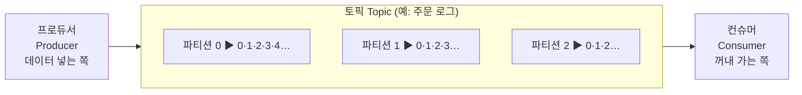
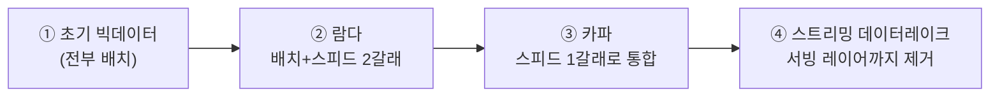

# 1. 카프카란?
여러 프로그램이 주고받는 데이터를 한곳에 모아서 흘려보내 주는 중앙 데이터 허브, 분산 이벤트 스트리밍 플랫폼

![[Pasted image 20260701114213.png|466]]

### 1) 왜 만들게 되었나?
소스 1개, 타깃 1개(1:1 연결)에서 소스도 늘고 타깃도 늘며 연결선이 복잡해짐(m×n)
따라서 서로서로 직접 연결하지 말고, 한곳(카프카)에 모아 처리하자 라는 발상을 하게 됨(m+n)

### 2) 내부 구조
메세지 큐 구조와 비슷함

**컨베이어 벨트 비유**

- 토픽(Topic) = 데이터 성격별로 나눈 컨베이어 벨트 라인. "주문 라인", "결제 라인"처럼 주제별로 나눔
- 파티션(Partition) = 그 벨트 라인을 여러 갈래로 쪼갠 것. 갈래가 많을수록 동시에 더 많이 실어나를 수 있음
- 오프셋(Offset) = 벨트 위 상자마다 붙는 순번 스티커. 컨슈머는 어디까지 가져갔는지 오프셋으로 기억
- 프로듀서(Producer) = 벨트에 상자를 올리는 사람
- 컨슈머(Consumer) = 벨트에서 상자를 집어가는 사람
- 브로커(Broker) = 카프카 서버 한 대

프로듀서가 토픽(여러 파티션)에 데이터를 FIFO로 넣고, 컨슈머가 오프셋 순서대로 꺼냄

# 2. 카프카 특징
**많이(처리량) · 유연하게(확장성) · 안 잃고(영속성) · 안 죽고(고가용성)**

### 1) 높은 처리량
프로듀서 -> 브로커, 브로커 -> 프로듀서 모두 데이터를 묶어서 한번에 (배치로) 전송
- 배치 전송으로 네트워크 통신 횟수를 줄여 대용량 실시간 로그도 처리 가능.
- 파티션 단위 병렬 처리: 같은 목적의 데이터를 여러 파티션에 나눠 담고 파티션 개수만큼 컨슈머를 늘리면 동일 시간당 처리량이 쭉 올라감

### 2) 확장성
데이터가 얼마나 들어올지 예측 못 하는 환경에서도, 규모에 맞춰 자연스럽게 늘리고 줄일 수 있는 성질
- scale-out(브로커 늘림) / scale-in(브로커 줄임)을 무중단으로 처리

### 3) 영속성
데이터를 만든 프로그램이 종료돼도, 데이터가 사라지지 않는 성질. 카프카는 받은 데이터를 메모리가 아니라 파일 시스템(디스크)에 저장
- 느리지 않나?
-> 카프카는 운영체제의 **페이지 캐시(page cache)** 를 씀. 한 번 읽은 파일 내용을 메모리(페이지 캐시)에 올려두고 재사용하기 때문에, 디스크에 안전하게 저장하면서도 메모리급 속도를 낼 수 있음

### 4) 고가용성
서버 일부에 장애가 나도 멈추지 않고 계속 서비스되는 성질. 카프카는 보통 브로커 3대 이상의 클러스터로 운영
- **복제 저장**: 프로듀서가 보낸 데이터를 한 브로커에만 두지 않고 다른 브로커에도 복사해 둠. 한 브로커가 죽어도 복제본이 남은 브로커에 있으니 데이터가 안 날아가고 처리가 이어짐

# 3. 카프카 역사

데이터 레이크 역사

### 1) 초기 빅데이터 플랫폼(전부 배치)
![[Pasted image 20260701115800.png|535]]
여러 서비스(Mobile logs·Web logs·IoT…)에서 온 데이터를 **엔드 투 엔드로, 배치(모아서 한꺼번에)** 처리

**한계**
- 배치라서 유연하지 못하고, 실시간이 안 됨 — 실시간으로 생기는 데이터의 인사이트를 서비스에 빨리 못 전달.
- 원천에서 파생된 데이터의 히스토리(변경 이력) 를 파악하기 어렵고, 가공이 계속되며 데이터가 파편화 → 데이터 거버넌스(데이터 표준·정책 관리)가 어려움.

### 2) 람다 아키텍처(배치+스피드)
![[Pasted image 20260701120100.png|525]]
- **배치 레이어**: 데이터를 모아 특정 시각·타이밍마다 한꺼번에 정확히 처리.
- **스피드 레이어**: 원천 데이터를 실시간으로 분석. 배치보다 낮은 지연이 필요할 때 이쪽에서 처리
- **서빙 레이어**: 가공된 결과를 사용자·서비스가 꺼내 쓰도록 저장해 두는 공간. (처리하는 곳 XX, 보관·제공하는 곳!)

**한계**
- 배치와 스피드 레이어가 각각의 로직으로 따로 존재해야함
- 배치와 실시간을 섞으면 파이프라인이 유연하지 못해짐, 같은 일을 두군데에 중복 구현해야함

### 3) 카파 아키텍처(배치가 사라짐!)
![[Pasted image 20260701120326.png|515]]
스피드 레이어에서 배치까지 다 처리!

##### 로그로 배치를 대신함
배치 데이터를 표현할 때 각 시점의 전체 데이터를 통째로 백업한 스냅샷으로 저장
-> 카파는 대신 각 시점의 "**변환 기록(change log)**"을 시간 순서대로 남김. 그러면 모든 시점의 스냅샷을 다 저장하지 않고도 배치 데이터를 표현 가능

![[Pasted image 20260701120836.png|536]]
ex)
카프카 로그에 1/1부터 12/31까지 시간표가 남아 있으니, "1월 1일~1월 10일 구간만" 딱 잘라 구체화된 뷰로 가져오면 그게 곧 그 기간의 배치 결과가 됨.
**구체화된 뷰(Materialized View)**: 필요한 구간·형태로 미리 계산해서 실체로 저장해 둔 결과 테이블. 매번 원본 로그를 처음부터 다시 계산하지 않고, 만들어 둔 뷰를 바로 읽어 빠름.

![[Pasted image 20260701121046.png|494]]

### 4) 스트리밍 데이터 레이크(서빙 레이어도 없앰) - 미래
![[Pasted image 20260701121220.png|519]]
분석·프로세싱을 끝낸 대용량 데이터를 카프카(스피드 레이어)에 **오래 저장**해 두고 사용할 수 있다면, 굳이 결과를 따로 보관하는 서빙 레이어가 없어도 됨. 서빙 레이어와 스피드 레이어를 이중으로 관리하던 운영 리소스를 줄임

##### BUT..
자주 안 쓰는 데이터까지 비싼 자원(브로커의 메모리·디스크)에 둘 필요는 없음. → 자주 쓰는 데이터는 브로커에, 자주 안 쓰는 데이터는 저렴하고 안전한 오브젝트 스토리지(예: S3)로 옮겨 **구분하는 작업이 필요**

# 4. 정리
| 주제              | 한 줄 요약                           | 키워드                                   |
| --------------- | -------------------------------- | ------------------------------------- |
| **탄생**          | 링크드인(2011) 파이프라인 파편화 → 중앙집중으로 해결 | m×n→m+n, Unified Log, 커플링 제거          |
| **정체**          | 대용량 데이터를 실시간으로 받아 흘려보내는 중앙 허브    | 분산 이벤트 스트리밍 플랫폼                       |
| **내부 구조**       | 메시지 큐(FIFO)를 그대로 계승              | 프로듀서·토픽·파티션·오프셋·컨슈머                   |
| **1) 처리량**      | 배치 전송 + 파티션 병렬로 대용량              | 네트워크 횟수↓, 파티션=처리량 손잡이                 |
| **2) 확장성**      | 무중단으로 서버 늘리고 줄임                  | scale-out / scale-in                  |
| **3) 영속성**      | 디스크에 저장해 안 사라짐(장애 복구)            | 파일 시스템, 페이지 캐시로 빠름                    |
| **4) 고가용성**     | 복제로 브로커 장애를 견딤                   | replication, 브로커 3대+, 리전 장애           |
| **초기 빅데이터**     | 전부 배치 → 실시간·유연·거버넌스 취약           | 원천→파생→서빙, 파편화                         |
| **람다**          | 배치 + 스피드 2갈래 (카프카=스피드)           | 3레이어, 로직 2벌 단점                        |
| **카파**          | 배치 제거·스피드만, 로그로 배치 대체            | 제이 크렙스, change log, Materialized View |
| **배치 vs 스트림**   | 한정(bounded) vs 무한(unbounded)     | 지연 분단위 vs 분단위 이하                      |
| **스트리밍 데이터레이크** | 서빙 레이어까지 제거, 카프카=롱텀 저장           | 2020, 오브젝트 스토리지 분리(과제)                |
