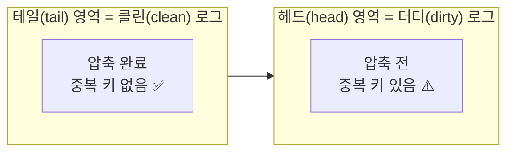

# 1. 카프카 생태계
![[Pasted image 20260702200029.png|533]]
 - **프로듀서 / 컨슈머**: 데이터를 넣는 쪽 / 빼는 쪽
 - **카프카 커넥트(Connect)**: 코드를 안 짜고 설정만으로 데이터를 넣고 빼는 파이프라인 도구. 소스 커넥트(외부 DB → 카프카), 싱크 커넥트(카프카 → 외부 저장소, 예: Elasticsearch).
 - **카프카 스트림즈(Streams)**: 카프카 토픽의 데이터를 실시간 가공해서 다시 토픽으로 내보내는 라이브러리. 

# 2. 브로커, 클러스터, 주키퍼
![[Pasted image 20260702200157.png|529]]
- **브로커(Broker)**: 카프카 서버 1대 = 브로커 1개(서버 1대에 브로커 프로세스 1개). 프로듀서가 보낸 데이터를 분산 저장·복제하는 일꾼.
- **클러스터(Cluster)**: 브로커 여러 대(보통 3대 이상)를 묶은 것. 1대로도 돌지만, 데이터를 안전하게 보관·처리하려면 여러 대를 묶음(→ 복제·고가용성).
- **주키퍼(ZooKeeper)**: 클러스터의 메타데이터(브로커 목록·컨트롤러 정보 등)를 관리·조율하는 별도 시스템. 카프카 클러스터를 켜려면 (예전엔) 주키퍼가 필수였음
-> BUT, 지금은 주키퍼 없어도 클러스터가 돌아감! **KRaft** 모드 도입함

#### 보완) 주키퍼(ZooKeeper)
- 정체: 카프카 전용이 아닌, 분산 시스템들이 공용으로 쓰는 **상태 공유 게시판 서버**. 하둡, HBase도 같은 이유로 사용
- 제공 기능 3가지: 작은 데이터 저장·조회 / 접속 끊긴 서버의 데이터 자동 삭제(→ 생존 감지) / 데이터 변경 시 구독자에게 알림
- 카프카에서의 용도: 브로커 생존 감시, 컨트롤러 선출("먼저 쓴 놈이 임자"), 메타데이터 보관
- 브로커와 **완전 별개 프로그램**. 설치·실행 명령어도 따로(`zookeeper-server-start.sh` / `kafka-server-start.sh`)
- znode: 주키퍼 내부의 폴더 개념. 주키퍼 1대로 클러스터 여러 개를 관리할 땐 root가 아닌 **클러스터별 하위 znode**로 격리해야 충돌 방지
- KRaft: 주키퍼의 역할을 카프카 내부로 흡수한 것. 브로커가 주키퍼가 된 게 아니라 **주키퍼가 사라진 것**. 4.0부터 완전 제거

# 3. 브로커의 역할
### 1) 컨트롤러
다른 브로커들의 상태를 체크하고, 어떤 브로커가 죽으면 그 브로커에 있던 리더 파티션을 다른 브로커로 재분배

### 2) 데이터 삭제
오직 브로커만 데이터를 삭제할 수 있음. 컨슈머·프로듀서는 삭제 요청도 못 함.
삭제는 파일 단위로 일어나고, 이 파일 단위를 로그 세그먼트(log segment)라고 부름

### 3) 컨슈머 오프셋 저장
컨슈머 그룹은 파티션에서 "어디까지 읽었는지"를 오프셋으로 커밋하는데, 이 커밋된 오프셋을 브로커가 `__consumer_offsets` 라는 내부 토픽에 저장함.
-> 다음에 컨슈머는 여기 저장된 오프셋을 보고 그 다음 레코드부터 이어서 처리

### 4) 그룹 코디네이터
컨슈머 그룹의 상태를 체크하고, 파티션을 컨슈머에 매칭해 나눠주는 역할. 컨슈머가 그룹에서 빠지면, 그 컨슈머가 맡던 파티션을 정상 컨슈머에게 재할당해 처리가 안 끊기게 함. 
-> 이 과정을 **리밸런스(rebalance)**

### 5) 데이터의 저장
카프카를 켤 때 `config/server.properties`의 **`log.dir`** 옵션에 지정한 디렉토리에 데이터를 저장함. 토픽 이름 + 파티션 번호 조합으로 하위 디렉토리를 만듦

#### 파티션 폴더 안
- `.log`: 실제 메시지 + 메타데이터 저장.
- `.index`: 메시지의 오프셋을 인덱싱한 정보(빨리 찾기용).
- `.timeindex`: 메시지의 timestamp 기준 인덱싱 정보.

# 4. 로그와 세그먼트
파티션에 쌓이는 데이터(로그)는 하나의 큰 파일이 아니라 여러 조각(세그먼트) 으로 나뉘어 저장
![[Pasted image 20260702201221.png|529]]
### 1) 액티브 세그먼트 (Active Segment) 
가장 마지막 세그먼트 = 지금 쓰기가 일어나는 파일을 액티브 세그먼트라고 함. 위 그림의 `000020.log(active)` 

### 2) 삭제
`cleanup.policy=delete`: 오래된 세그먼트를 통째로 삭제하는 기본 정책. 삭제는 세그먼트(파일) 단위 → 그래서 레코드 하나만 골라 삭제하는 건 불가능
- `retention.ms`: 세그먼트 보유 최대 기간. 기본 7일.
- `retention.bytes`: 파티션당 로그 최대 바이트. 기본 -1(제한 없음).
- `log.retention.check.interval.ms`: 세그먼트가 삭제 영역에 들어왔는지 확인하는 간격. 기본 5분.

`cleanup.policy=compact`: 압축
![[Pasted image 20260702201531.png|564]]

# 5. 복제
복제된 파티션은 **리더(leader)** 와 **팔로워(follower)** 로 나눔
- 리더 파티션: 프로듀서·컨슈머와 직접 통신함 
- 팔로워 파티션: 리더를 복사(백업) 해 두는 대기 선수. 리더의 오프셋을 확인해 차이 나면 리더에게서 데이터를 가져와 자기한테 저장(= 이 과정이 복제).
