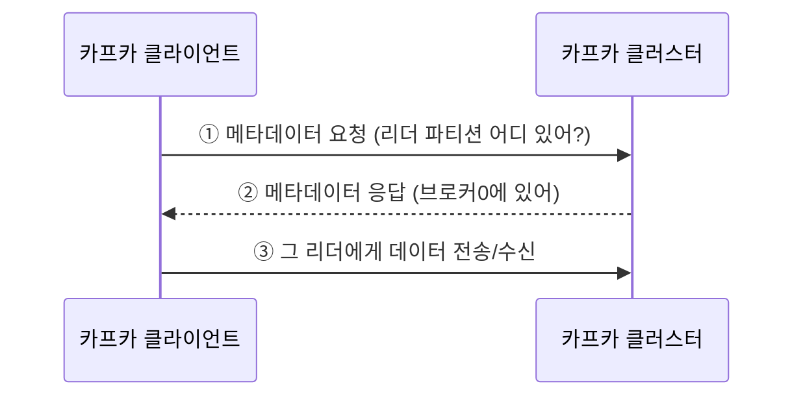

# 1. 토픽과 파티션
- 토픽(Topic): 카프카에서 데이터를 구분하는 단위. 1개 이상의 파티션을 소유. 
- 파티션(Partition): 프로듀서가 보낸 데이터(레코드)가 실제로 저장되는 곳. FIFO 큐와 비슷하지만 → 꺼내도(pop) 삭제되지 않는 게 일반 큐와 다른 점!

-> 어떻게 파티션이 배치되는가: 라운드로빈에서 스티키로 바뀜!(2.4 이후)

# 2. 레코드
![[Pasted image 20260702202211.png|464]]

| 요소            | 뜻      | 포인트                                                                                       |
| ------------- | ------ | ----------------------------------------------------------------------------------------- |
| **timestamp** | 시간     | 스트림 처리용. 기본 = 프로듀서 생성시간(CreateTime), 또는 브로커 적재시간(LogAppendTime). `message.timestamp.type` |
| **offset**    | 순번     | 프로듀서엔 **없음** → 브로커 적재 시 부여. **0부터 1씩↑**. 중복 처리 방지                                         |
| **headers**   | 부가정보   | 0.11부터. key/value로 스키마 버전·포맷 등                                                            |
| **key**       | 메시지 키  | **파티셔닝**용(어느 파티션 갈지). 아래 참고                                                               |
| **value**     | 실제 데이터 | 진짜 처리할 내용. 직렬화/역직렬화 필요                                                                    |

# 3. 카프카 브로커와 클라이언트가 통신하는 법

클라이언트(프로듀서·컨슈머)는 반드시 리더 파티션과 통신해야 함. 그래서 데이터를 주고받기 전에, 브로커로부터 메타데이터(어느 브로커에 어느 리더 파티션이 있는지)를 받아옴