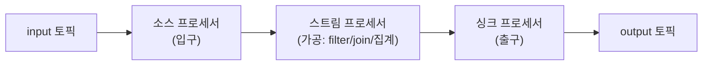

# 1. 카프카 스트림즈
![[Pasted image 20260721113418.png|513]]
카프카 토픽을 input으로 받아, 실시간으로 가공한 뒤, 다시 카프카 토픽으로 output 하는 **경량 스트림 처리 라이브러리**

### 특징
1. **카프카 공식(내장) 라이브러리**: 카프카를 만든 곳에서 함께 제공. 카프카 버전과 스트림즈 버전을 맞추기 쉽고, 브로커와 궁합이 검증돼 있다. (스파크·플링크 같은 외부 프레임워크와 대비되는 포인트)
2. **자바 라이브러리 (JVM 기반)**: 별도 클러스터(마스터/워커)를 띄우는 게 아니라, 그냥 자바 애플리케이션 안에 라이브러리로 들어가서 돈다 → 배포가 가볍다.
3. **장애에 강함(fault tolerant) + exactly once** — 처리 도중 죽어도 정확히 한 번 처리를 보장합니다. 이를 위해 상태(state)를 로컬 rocksDB에 저장하고, 그 변경 이력을 changelog 토픽으로 카프카에 백업한다. (죽었다 살아나면 changelog로 상태 복원)
4. **상태·비상태 처리 둘 다 적합** — filter·map처럼 과거를 기억할 필요 없는 비상태기반(stateless) 처리부터, 집계·조인·윈도우처럼 이전 상태를 들고 있어야 하는 상태기반(stateful) 처리까지 메서드로 제공한다. (상태기반 처리는 아래 rocksDB·changelog가 받쳐준다)

### 내부 구조
![[Pasted image 20260721112635.png|337]]
태스크: 처리의 최소 단위, 파티션 수 = 태스크 수
	input 토픽 파티션이 3개면 → 태스크도 3개가 생겨서 파티션 하나씩 맡는다. **파티션 1개 = 태스크 1개**

![[Pasted image 20260721112857.png|500]]
토폴로지: 데이터가 어떤 순서로 처리되는지 그린 흐름도
	카프카 스트림즈의 토폴로지는 **트리 형태**로, 세 종류의 **프로세서(processor)** 노드로 이루어짐

| 프로세서                 | 역할                                  | 비유                |
| -------------------- | ----------------------------------- | ----------------- |
| 소스 프로세서(source)  | 토픽에서 데이터를 가져오는 입구. 토폴로지의 시작점    | 공장 입구(원재료 반입) |
| 스트림 프로세서(stream) | 가져온 데이터를 가공(filter·join·집계 등)   | 중간 가공대        |
| 싱크 프로세서(sink)    | 가공한 데이터를 토픽으로 내보내는 출구. 토폴로지의 끝점 | 공장 출구(완제품 출하) |

토폴로지에서 노드 = 프로세서라면, 노드와 노드를 잇는 선 = 스트림(stream)
이 스트림이 곧 토픽의 데이터이고, 프로듀서, 컨슈머에서 쓰던 레코드와 똑같은 것이다.
즉 프로세서 사이를 흐르는 레코드의 줄기가 스트림.

### 개발 방법
스트림즈DSL vs 프로세서API

| 구분      | **스트림즈DSL** (Streams DSL)                   | **프로세서 API** (Processor API) |
| ------- | ------------------------------------------- | ---------------------------- |
| 스타일     | 이미 만들어진 메서드 조합(filter, join, `windowedBy`…) | 토폴로지를 직접 조립                  |
| 데이터 추상화 | KStream / KTable / GlobalKTable 제공          | 이 개념들이 없음                    |
| 편의성     | 높음 — 대부분의 처리를 짧게                            | 낮음(투박) 대신 자유도 높음             |
| 언제?     | 필터·조인·집계 등 일반적 처리                           | DSL에 없는 상세 로직이 필요할 때         |
평소엔 스트림즈DSL로 짜다가, DSL이 제공하지 않는 세밀한 로직이 필요할 때만 프로세서API

ex)
- 스트림즈DSL이 편한 일: "메시지 값에 따라 다른 토픽으로 분기", "지난 10분간 들어온 데이터 개수 집계" 같은 일반적 처리.
- 프로세서API가 필요한 일: "메시지 값 종류에 따라 토픽을 가변적으로 바꿔 전송", "일정 시간 간격마다 데이터를 처리" 같은 DSL 메서드로는 안 되는 상세 로직.

# 2. 스트림즈 DSL
### KStream
![[Pasted image 20260721114403.png|297]]
모든 레코드를 처음부터 끝까지 하나하나 순서대로 다루는 관점
	ex) 레코드가 100개 들어왔으면 100개 전부가 처리 대상

### KTable
![[Pasted image 20260721114414.png|287]]
같은 메시지 키가 여러 번 들어오면 가장 최신 레코드 하나만 유효하게 보는 관점
	ex) 키가 곧 식별자이고, 값은 덮어쓰기(upsert)

### GlobalKTable
![[Pasted image 20260721114842.png|373]]
KTable처럼 키별 최신값을 보되, 토픽의 모든 파티션 데이터를 모든 태스크가 통째로 복사해서 공유
- KTable: 각 태스크가 **자기 파티션 몫만** 들고 있음(부분).
- GlobalKTable: **모든 태스크가 전체 데이터를 다 들고 있음**(전체 복제).

|        | **KStream** | **KTable**           | **GlobalKTable**          |
| ------ | ----------- | -------------------- | ------------------------- |
| 보는 관점  | 모든 레코드(이벤트) | 키별 **최신값**           | 키별 **최신값**                |
| 데이터 범위 | 흐름 전체       | **각 태스크 = 자기 파티션 몫** | **모든 태스크 = 전체 복제**        |
| 성격     | 흐르는 강물      | 부분 장부                | 전체 장부(복사본)                |
| 대표 용도  | 이벤트 로그      | 상태/현황                | 작은 참조 데이터, 코파티셔닝 안 될 때 조인 |

### 코파티셔닝 - 조인 전제 조건
![[Pasted image 20260721114429.png|316]]
KStream과 KTable을 join하려면 두 토픽이 코파티셔닝되어 있어야 한다

두 토픽이 **1) 파티션 개수가 동일**하고 **2) 파티셔닝 전략(메시지 키를 파티션에 배분하는 규칙)이 동일**하면 
	→ **코파티셔닝**

##### 코파티셔닝 안 되면?: TopologyException
파티션 수나 전략이 다른 두 토픽을 그냥 조인하면 `TopologyException` 이 발생한다
해결:
1. 리파티셔닝(repartition): 한쪽 토픽을 파티션 수·전략을 맞춰 새 토픽으로 다시 만들기
2. GlobalKTable로 선언: 어차피 전체를 모든 태스크가 들고 있으니 코파티셔닝이 필요 없다
	작은 참조 데이터라면 이게 간편