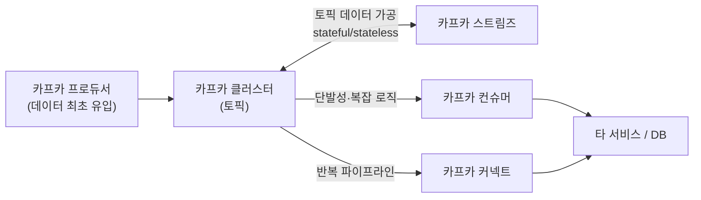

# 1. 카프카 기술 별 아키텍처 적용 방법 정리

넣기 = 프로듀서
토픽끼리 가공 = 스트림즈
외부와 반복 연결 = 커넥트
그 외 특수/단발 = 컨슈머

```mermaid
graph LR
    P["카프카 프로듀서<br/>(데이터 최초 유입)"] --> K["카프카 클러스터<br/>(토픽)"]
    K <-->|"토픽 데이터 가공<br/>stateful/stateless"| ST["카프카 스트림즈"]
    K -->|"단발성·복잡 로직"| CS["카프카 컨슈머"]
    K -->|"반복 파이프라인"| CN["카프카 커넥트"]
    CS --> EXT["타 서비스 / DB"]
    CN --> EXT
```

